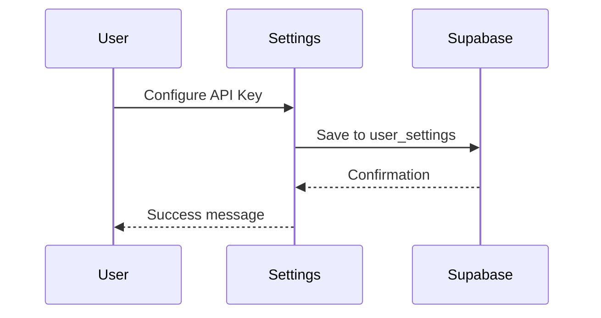
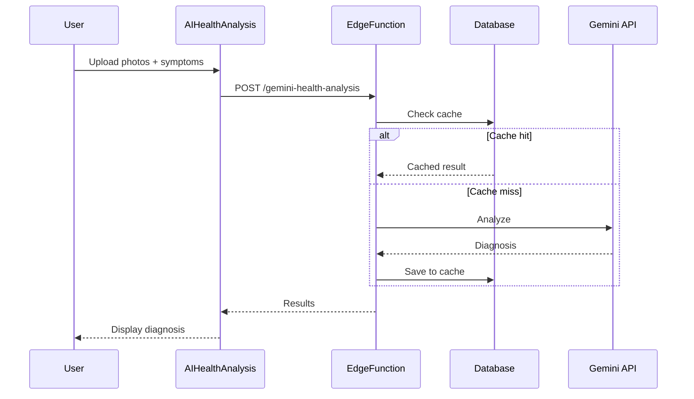

# 🤖 Intégration de l'API Gemini avec Supabase

## Vue d'ensemble

L'application AviprodApp intègre l'API Google Gemini pour fournir une analyse de santé par IA des volailles. Cette intégration utilise Supabase Edge Functions pour sécuriser les appels API et gérer le cache des résultats.

## Architecture

```
┌─────────────────┐
│  React Native   │
│   Application   │
└────────┬────────┘
         │
         ▼
┌─────────────────┐
│    Supabase     │
│  Edge Function  │
│  (gemini-health │
│    -analysis)   │
└────────┬────────┘
         │
         ├──────────────────┐
         │                  │
         ▼                  ▼
┌─────────────────┐  ┌──────────────┐
│   Gemini API    │  │   Supabase   │
│  (Google AI)    │  │   Database   │
└─────────────────┘  └──────────────┘
```

## Composants

### 1. Base de données Supabase

#### Table `user_settings`
Stocke les clés API Gemini des utilisateurs de manière sécurisée.

```sql
create table user_settings (
  id uuid primary key default gen_random_uuid(),
  user_id uuid references auth.users(id) unique,
  gemini_api_key text,
  created_at timestamptz default now(),
  updated_at timestamptz default now()
);
```

#### Table `ai_health_analyses`
Stocke l'historique des analyses et sert de cache.

```sql
create table ai_health_analyses (
  id uuid primary key default gen_random_uuid(),
  user_id uuid references auth.users(id),
  lot_id text,
  images text[],
  symptoms text[],
  diagnosis text,
  confidence integer,
  treatment_plan text,
  recommended_products jsonb,
  cache_key text unique,
  created_at timestamptz default now(),
  updated_at timestamptz default now()
);
```

### 2. Edge Function: `gemini-health-analysis`

L'Edge Function gère:
- ✅ Authentification de l'utilisateur
- ✅ Récupération de la clé API depuis `user_settings`
- ✅ Vérification du cache avant l'appel API
- ✅ Appel à l'API Gemini
- ✅ Sauvegarde des résultats dans le cache
- ✅ Retour des résultats au client

**Endpoint**: `https://hchzfybgcgzjmtlusywf.supabase.co/functions/v1/gemini-health-analysis`

**Méthode**: POST

**Headers**:
```json
{
  "Content-Type": "application/json",
  "Authorization": "Bearer <user_access_token>"
}
```

**Body**:
```json
{
  "images": ["image_uri_1", "image_uri_2"],
  "symptoms": ["Léthargie", "Perte d'appétit"],
  "lotId": "lot_123"
}
```

**Response**:
```json
{
  "id": "uuid",
  "diagnosis": "Infection Respiratoire",
  "confidence": 85,
  "treatmentPlan": "Isolement immédiat...",
  "recommendedProducts": [...],
  "cached": false
}
```

### 3. Composant React Native: `AIHealthAnalysis`

Le composant gère l'interface utilisateur pour:
- 📸 Capture/sélection de photos
- 🩺 Sélection des symptômes
- 🔄 Appel de l'Edge Function
- 📊 Affichage des résultats

### 4. Écran de configuration: `settings.tsx`

Permet aux utilisateurs de:
- 🔑 Configurer leur clé API Gemini
- 🧪 Tester la validité de la clé
- 💾 Sauvegarder la configuration

### 5. Historique: `ai-history.tsx`

Affiche:
- 📋 Liste des analyses précédentes
- 🔍 Détails de chaque analyse
- 🗑️ Suppression d'analyses

## Flux d'utilisation

### 1. Configuration initiale



### 2. Analyse de santé



## Avantages de cette architecture

### 🔒 Sécurité
- Les clés API ne sont jamais exposées côté client
- Authentification requise pour tous les appels
- RLS (Row Level Security) sur toutes les tables

### 💰 Économies
- Système de cache intelligent
- Évite les appels API redondants
- Réduction des coûts d'utilisation de Gemini

### 📊 Traçabilité
- Historique complet des analyses
- Métriques d'utilisation
- Audit trail

### ⚡ Performance
- Réponses instantanées pour les résultats en cache
- Edge Functions déployées globalement
- Latence minimale

## Configuration requise

### 1. Obtenir une clé API Gemini

1. Visitez [Google AI Studio](https://makersuite.google.com/app/apikey)
2. Connectez-vous avec votre compte Google
3. Cliquez sur "Create API Key"
4. Copiez la clé générée

### 2. Configurer dans l'application

1. Ouvrez l'application AviprodApp
2. Allez dans **Profil** → **Configuration IA**
3. Collez votre clé API
4. Cliquez sur **Tester** pour vérifier
5. Cliquez sur **Sauvegarder**

## Utilisation

### Effectuer une analyse

1. Allez dans **Santé** → **Analyse IA**
2. Ajoutez des photos de vos volailles
3. Sélectionnez les symptômes observés
4. Cliquez sur **Analyser avec Gemini AI**
5. Attendez les résultats (3-5 secondes)
6. Consultez le diagnostic et le plan de traitement

### Consulter l'historique

1. Allez dans **Santé**
2. Cliquez sur l'icône d'horloge (⏰)
3. Parcourez vos analyses précédentes
4. Cliquez sur une analyse pour voir les détails

## Modèle Gemini utilisé

**Modèle**: `gemini-1.5-flash`

**Caractéristiques**:
- ⚡ Rapide et efficace
- 💰 Coût réduit
- 🎯 Précision élevée pour l'analyse de texte
- 📸 Support des images (à venir)

## Limites et considérations

### Quotas API
- Gemini Free Tier: 60 requêtes/minute
- Gemini Pro: Quotas plus élevés

### Coûts
- Free Tier: Gratuit jusqu'à un certain nombre de requêtes
- Au-delà: Facturation selon l'utilisation

### Précision
- L'IA fournit des suggestions, pas un diagnostic vétérinaire définitif
- Toujours consulter un vétérinaire pour les cas graves

## Améliorations futures

### 🎯 Court terme
- [ ] Support de l'analyse d'images (actuellement texte uniquement)
- [ ] Traductions multilingues des diagnostics
- [ ] Notifications pour les analyses critiques

### 🚀 Moyen terme
- [ ] Intégration avec le marketplace pour recommandations de produits
- [ ] Statistiques et tendances de santé
- [ ] Export PDF des rapports d'analyse

### 🌟 Long terme
- [ ] Modèle IA personnalisé entraîné sur les données avicoles
- [ ] Détection précoce des épidémies
- [ ] Recommandations préventives basées sur l'historique

## Support et dépannage

### Erreur: "Clé API non configurée"
**Solution**: Allez dans Configuration IA et ajoutez votre clé API Gemini.

### Erreur: "Clé API invalide"
**Solution**: Vérifiez que vous avez copié la clé complète depuis Google AI Studio.

### Erreur: "Quota dépassé"
**Solution**: Attendez quelques minutes ou passez à un plan payant.

### Erreur: "Connexion échouée"
**Solution**: Vérifiez votre connexion internet et réessayez.

## Ressources

- [Documentation Gemini API](https://ai.google.dev/docs)
- [Supabase Edge Functions](https://supabase.com/docs/guides/functions)
- [Google AI Studio](https://makersuite.google.com/)

## Licence

Cette intégration est fournie dans le cadre de l'application AviprodApp.
L'utilisation de l'API Gemini est soumise aux [Conditions d'utilisation de Google](https://policies.google.com/terms).
